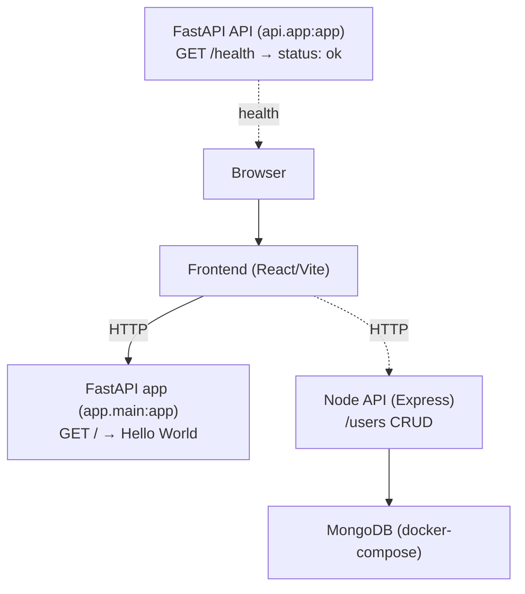

# Full-Stack Starter: FastAPI + Express + React + MongoDB

A developer-friendly starter repository that includes:
- Python FastAPI Hello World app (app/main.py)
- A second FastAPI API with a health endpoint (api/app.py)
- Node.js Express API with Mongoose and Jest (node_api/)
- React + Vite frontend (frontend/)
- docker-compose for a local MongoDB instance used by the Node API

This single top-level README explains how the pieces fit together and how to run and test each part locally.

## Repository layout
- app/: FastAPI Hello World app (app.main:app)
  - Endpoint: GET / → {"message": "Hello, World!"}
  - Tests target this service (see tests/test_app.py)
- api/: Alternate FastAPI API (api.app:app)
  - Endpoint: GET /health → {"status": "ok"}
  - Runnable via Uvicorn or as a script (python api/app.py)
- node_api/: Express + Mongoose Users API with Jest tests
  - Users CRUD at /users
- frontend/: React + Vite SPA
- docker-compose.yml: MongoDB service for node_api local development
- tests/: Pytest suite for the Python apps
  - tests/test_app.py covers the Hello World app
  - tests/api/test_health.py covers the health endpoint in api/

## Architecture and component interactions
The components are designed to be runnable independently for local development. A typical setup is the React frontend talking to the FastAPI app; the Node API can be developed separately and uses MongoDB (via docker-compose) when needed.

Notes:
- There are two Python FastAPI services. app/ is the primary Hello World service covered by tests. api/ is a separate example service with a simple health endpoint.
- MongoDB is only required for the Node API; the Python apps do not depend on Mongo.

## Prerequisites
- Docker Desktop (or compatible) if you want to run MongoDB locally for the Node API.
- Python 3.11+ recommended for the FastAPI apps.
- Node.js 18+ recommended for frontend/ and node_api/.

## Setup
### Python environment
1) Create and activate a virtual environment (recommended)
- Unix/macOS:
  - python3 -m venv .venv
  - source .venv/bin/activate
- Windows (PowerShell):
  - py -3 -m venv .venv
  - .venv\\Scripts\\Activate.ps1

2) Install dependencies for the Python apps:
- pip install -r requirements.txt
- Optional: if you maintain a separate environment for api/, you can use api/requirements.txt as well.

### Node dependencies
- Install Node API dependencies:
  - npm install --prefix node_api
- Install frontend dependencies:
  - npm install --prefix frontend

### Environment for node_api
- Copy the example env file and adjust if needed:
  - cp node_api/.env.example node_api/.env
- MONGODB_URI defaults to mongodb://localhost:27017/node_api which works with the docker-compose MongoDB service.

## Running each component
### FastAPI Hello World (app/)
- Start the development server:
  - uvicorn app.main:app --reload
- Verify:
  - curl http://127.0.0.1:8000/ → {"message":"Hello, World!"}

### FastAPI Health API (api/)
- Start with Uvicorn:
  - uvicorn api.app:app --reload
- Or run directly:
  - python api/app.py
- Verify:
  - curl http://127.0.0.1:8000/health → {"status":"ok"}
- Port note: If you run both FastAPI services at once, run one on a different port, e.g. uvicorn api.app:app --reload --port 8001

### MongoDB for Node API
- Start MongoDB in the background:
  - docker-compose up -d mongo
- Stop and remove the service when done:
  - docker-compose stop mongo
  - docker-compose rm -f mongo

### Node API (node_api/)
- Start the dev server (defaults to port 3000):
  - npm run dev --prefix node_api
- Verify base route (if implemented):
  - curl http://127.0.0.1:3000/
- Users API examples:
  - List users: curl http://127.0.0.1:3000/users
  - Create user: curl -X POST http://127.0.0.1:3000/users -H 'Content-Type: application/json' -d '{"name":"Alice","email":"alice@example.com"}'
  - Get by id: curl http://127.0.0.1:3000/users/<id>
  - Update: curl -X PATCH http://127.0.0.1:3000/users/<id> -H 'Content-Type: application/json' -d '{"name":"Alice Updated"}'
  - Delete: curl -X DELETE http://127.0.0.1:3000/users/<id>
- Notes:
  - Ensure MongoDB is running (docker-compose up -d mongo) and MONGODB_URI in node_api/.env points to it.

### Frontend (frontend/)
- Start Vite dev server:
  - npm run dev --prefix frontend
- Open the printed URL (typically http://localhost:5173) in your browser.
- Build for production:
  - npm run build --prefix frontend

## Testing
### Python tests
- Run from repository root:
  - pytest -q
- Tests cover:
  - app/main.py behavior (GET / → Hello, World!) in tests/test_app.py
  - api/app.py health endpoint (GET /health → ok) in tests/api/test_health.py
- Note: Tests use FastAPI TestClient and do not require running servers.

### Node API tests
- Run from repository root:
  - npm test --prefix node_api
- Tests use an in-memory MongoDB server; no external MongoDB instance is required for the test suite.

## Troubleshooting
- Port in use (e.g., 8000 or 3000): stop the conflicting service or change the port (e.g., uvicorn ... --port 8001, or set PORT for Node).
- MongoDB connection errors: ensure docker-compose up -d mongo is running and MONGODB_URI matches your setup.
- Missing dependencies: re-run pip install -r requirements.txt and/or npm install --prefix <dir>.

## Contribution guidelines
- Workflow: fork → feature branch → small, focused PRs.
- Tests: require green tests for both Python (pytest) and Node (npm test) before requesting review.
- Code style:
  - Python: follow PEP 8; use black/isort if configured.
  - Node/React: follow eslint/prettier defaults if configured.
- Commit messages: use imperative mood and reference issues when applicable.

## License
No LICENSE file is present in this repository at this time. As a result, the code is not licensed for reuse by default. Consider adding a standard open-source license (e.g., MIT) in a future PR to formalize permissions.

## How to verify your setup
- FastAPI app: uvicorn app.main:app --reload then curl http://127.0.0.1:8000/ → {"message":"Hello, World!"}
- Alternate API: uvicorn api.app:app --reload (or python api/app.py) then curl http://127.0.0.1:8000/health → {"status":"ok"}
- Node API: docker-compose up -d mongo then npm run dev --prefix node_api and visit or curl http://127.0.0.1:3000/users
- Frontend: npm run dev --prefix frontend and open the Vite URL (typically http://localhost:5173)

## Consistency checks (no network required)
- Python bytecode compilation: python -m compileall -q app api
- Python tests: pytest -q

